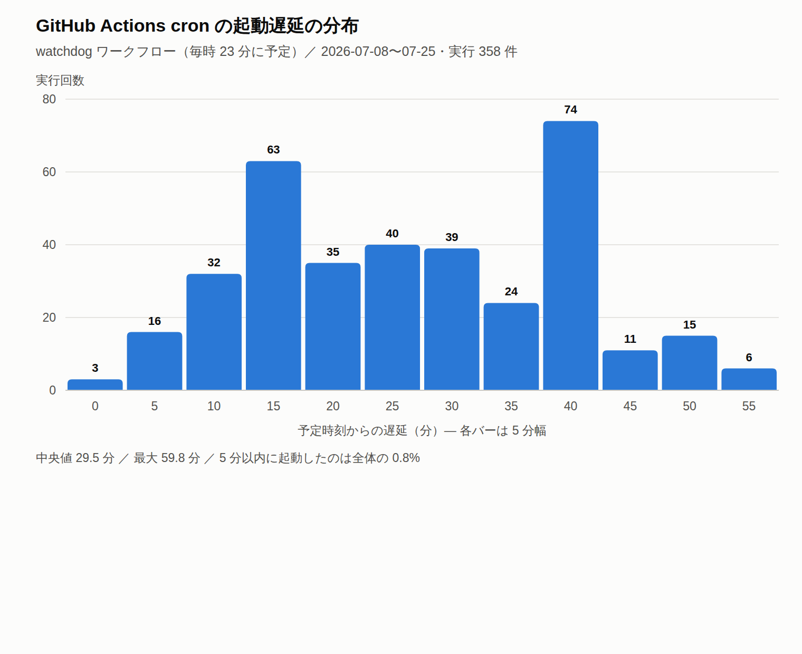
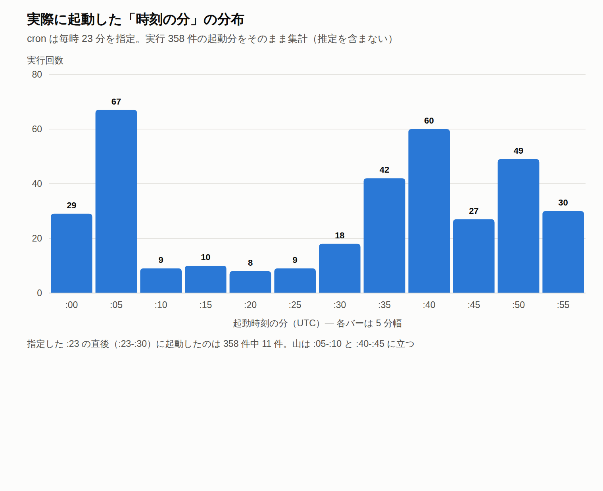

# GitHub Actions の cron は実際どれくらい遅れるのか、半月分のログで測ってみた

## TL;DR

- GitHub Actions の `schedule` トリガーで動かしているワークフローの起動ログを、**16.5日ぶん（358件）**集めて遅延を実測した
- 結果：遅延の中央値 **29.5分**、平均 **29.5分**、最大 **59.8分**、予定 398 回に対して **40回（10.1%）が実行されなかった**
- **5分以内に起動したのは全体の 0.8%。** 予定どおりに動くことは、ほぼ無い
- 同じリポジトリで並走している外部スケジューラ（cron-job.org → `workflow_dispatch`）は、15分間隔の **97.7% が ±1分以内**、欠測 0.6%
- おまけ：cron に `*/15` を指定していた頃の記録も残っていた。**実際の間隔は中央値 51.3分、7割が間引かれていた**
- 結論：**分単位の精度を要求する用途には向かない。数十分〜1時間粒度の記録なら実用に足る**

サーバーもDBも借りずに家の環境データを貯める構成そのものの解説も兼ねています。

リポジトリ：https://github.com/junia2009/smart_home_db

---

## なぜ測ろうと思ったか

GitHub Actions の `on.schedule` について、公式ドキュメントにはこう書かれています。

> 高負荷時にはワークフローの開始が遅延、あるいは実行されないことがある

ドキュメントにも多くの記事にも「遅れることがある」とは書いてあるのですが、**実際どれくらい遅れるのかを数字で示したものが見当たりませんでした。**

家の温湿度を記録する用途を組んだところ、ちょうど遅延がそのままデータの欠測・偏りになる構成だったので、副産物としてログが取れました。せっかくなので測りました。

### 先に白状しておくと、収集本体は GitHub cron を使っていません

この記事の測定対象を誤解なく書いておきます。

温湿度の収集（15分間隔）は、**GitHub cron ではなく外部スケジューラ（cron-job.org）から `workflow_dispatch` API を叩いて**起動しています。

ただし最初からそうだったわけではなく、コミット履歴にはそのまま迷走の跡が残っています。

| 時期 | cron 設定 | 顛末 |
|---|---|---|
| 最初 | `*/15 * * * *` | 素直に15分間隔を指定 |
| 半日後 | `3,18,33,48 * * * *` | 「0/15/30/45分は混んで間引かれやすい」と考えて3分ずらした |
| 翌日 | `9 * * * *` | 外部スケジューラに主役を譲り、毎時フォールバックとしてのみ残す |
| その35分後 | （削除） | フォールバックも廃止し `workflow_dispatch` 一本に |

**丸一日ももたずに諦めています。** この記事は、その時に「なんとなく遅い」で済ませた部分を、後からちゃんと数字にしたものです。

一方で、**収集が止まっていないかを監視する watchdog ワークフローだけは GitHub cron（毎時）で動かしています。** 監視は「おおよそ毎時動けばよい」ので遅延が許容でき、かつ収集と経路を分けること自体が目的（共倒れ防止）だからです。

つまりこのリポジトリには、

- GitHub cron で毎時起動する watchdog
- 外部スケジューラで15分ごとに起動する collect

が**同じ期間・同じリポジトリで並走している**という、比較にはかなり都合のいい状態ができていました。この記事で測るのは前者です。後者は比較対象として最後に出します。

## 構成

まず前提となる構成を簡単に。

```
外部スケジューラ (cron-job.org, 15分間隔)
      │
      └─→ workflow_dispatch API で GitHub Actions を起動
            │
            ├─→ SwitchBot API v1.1 でデバイスの温湿度を取得
            ├─→ 同一リポジトリの data/*.json に追記してコミット
            ├─→ GitHub Pages が data/*.json をそのまま配信 → ブラウザで可視化
            └─→ 閾値を超えていたら LINE Messaging API で通知

GitHub Actions cron (毎時)   ← この記事で測るのはここ
      │
      └─→ watchdog: 最終記録が古すぎたら「収集が止まった」と LINE 通知
```

**常時起動のマシンも、DBも、外部サービスの契約も無し。**
リポジトリがそのままデータストアで、Pages がそのまま配信サーバーです。

比較検討したもの：

| 案 | 見送った理由 |
|---|---|
| Raspberry Pi | 電源とOSの面倒を見たくない。停電・SDカード寿命が怖い |
| Cloudflare Workers + KV | 悪くない。ただ「データをGitで見られる」利点が欲しかった |
| Firebase | 個人の温湿度ログには構成が重い |

「データがただのJSONファイルとしてGitの履歴に残る」のが、この構成の一番の気持ちよさだと思っています。差分がそのまま観測の履歴になります。

---

## SwitchBot API v1.1 の認証

ここが実装で一番つまずいたので、先に書いておきます。

v1.0 はトークンをヘッダに入れるだけでしたが、**v1.1 からは HMAC-SHA256 の署名が必須**になりました。トークン、シークレット、nonce、タイムスタンプから署名を作ってヘッダに載せます。

```js
import { createHmac, randomUUID } from 'node:crypto';

function switchbotHeaders(token, secret) {
  const t = Date.now().toString();
  const nonce = randomUUID();
  const sign = createHmac('sha256', secret)
    .update(token + t + nonce)
    .digest('base64')
    .toUpperCase();

  return {
    Authorization: token,
    sign,
    t,
    nonce,
    'Content-Type': 'application/json',
  };
}
```

ハマったポイント：

- **署名の元文字列は `token + t + nonce` の連結順が固定**。順番を間違えると 401 が返るだけで、理由は教えてくれません
- `t` は**ミリ秒**。秒でやると通りません
- 出力は **base64**。hex ではありません

デバイス一覧の取得はこれだけです。

```js
const res = await fetch('https://api.switch-bot.com/v1.1/devices', {
  headers: switchbotHeaders(process.env.SWITCHBOT_TOKEN, process.env.SWITCHBOT_SECRET),
});
```

なお SwitchBot API は HTTP 200 を返しつつ本文の `statusCode` でエラーを伝えてくるので、`res.ok` だけ見ていると失敗を握りつぶします。`statusCode !== 100` も併せて見る必要があります。

トークンとシークレットは GitHub の **Secrets** に入れます。パブリックリポジトリの場合、レスポンスをまるごと `console.log` すると**デバイスIDがログに残る**ので、そこだけ注意してください（Actions のログは誰でも見られます）。

## ワークフロー

収集側は、起動トリガーが `workflow_dispatch` だけです。

```yaml
name: collect

on:
  # 起動は外部スケジューラ(cron-job.org)が workflow_dispatch API で行う
  workflow_dispatch:

permissions:
  contents: write

concurrency:
  group: collect
  cancel-in-progress: false

jobs:
  collect:
    runs-on: ubuntu-latest
    steps:
      - uses: actions/checkout@v4

      - name: Fetch sensor data and evaluate alerts
        env:
          SWITCHBOT_TOKEN: ${{ secrets.SWITCHBOT_TOKEN }}
          SWITCHBOT_SECRET: ${{ secrets.SWITCHBOT_SECRET }}
          HUB2_DEVICE_ID: ${{ secrets.HUB2_DEVICE_ID }}
          LINE_CHANNEL_TOKEN: ${{ secrets.LINE_CHANNEL_TOKEN }}
        run: node scripts/collect.mjs

      - name: Commit and push data
        # 通知送信に失敗しても測定データのコミットは行う
        if: always()
        run: |
          git config user.name "github-actions[bot]"
          git config user.email "github-actions[bot]@users.noreply.github.com"
          git add data/
          if git diff --cached --quiet; then
            echo "no changes"
            exit 0
          fi
          git commit -m "data: record $(date -u +'%Y-%m-%dT%H:%MZ')"
          for i in 1 2 3 4; do
            if git push; then
              exit 0
            fi
            git pull --rebase
            sleep $((2 ** i))
          done
          git push
```

外部から叩くのはこれだけです。

```
POST https://api.github.com/repos/<owner>/<repo>/actions/workflows/collect.yml/dispatches
Authorization: Bearer <fine-grained PAT (Actions: Read and write)>
Body: {"ref":"main"}
```

3点だけ補足します。

- `git diff --cached --quiet` で早期 exit しているのは、**差分が無いときに commit が失敗してジョブが赤くなるのを防ぐため**です。これが無いと失敗通知が飛び続けます
- `if: always()` を付けているのは、LINE 通知に失敗しても測定データだけは残したいからです
- push をリトライループで囲んでいるのは、`concurrency` で直列化していても watchdog や compact のコミットと競合しうるためです。`git pull --rebase` してから指数バックオフで再試行します

そして測定対象の watchdog 側。こちらは素直に GitHub cron です。

```yaml
on:
  schedule:
    - cron: "23 * * * *"
  workflow_dispatch:
```

`:00` を避けて `:23` にしているのは、さきほどの表で collect を `3,18,33,48` にしたのと同じ発想です。**キリのいい時刻ほど混むだろう、という素朴な予想。** 結果的にこれは**ほとんど意味がありませんでした**（後述）。

## データの持ち方

最初は単一の `data.json` に全部追記していましたが、すぐにやめました。

**1ファイル追記の問題：**
- コミットごとにファイル全体が差分になり、リポジトリが太る
- ブラウザ側が毎回全期間を読む羽目になる

**月次分割にした：**

```
data/
  2026-07.json          ← 温湿度・照度
  power-2026-07.json    ← プラグの消費電力
  alert-state.json      ← 通知の抑制状態
  watchdog-state.json   ← 死活監視の状態
```

月別 JSON は **1レコード1行**で書き出しています。こうしておくと追記のたびに差分が1行だけになり、`git log -p` がそのまま観測ログとして読めます。

```js
function serializeRecords(records) {
  return '[\n' + records.map((r) => JSON.stringify(r)).join(',\n') + '\n]\n';
}
```

ダッシュボードは表示レンジに必要な月のファイルだけを読みます（最大2ヶ月）。

半月運用した実績値：

- コミット数：**1,769**（約 95 コミット/日）
- `.git` を含むリポジトリサイズ：**約 2.0 MB**（うち `.git` が 1.8 MB、`data/` の実体は 217 KB）
- 単純に外挿すると1年で **約 40 MB / 約 3.5万コミット**

40 MB なら放っておいても数年は問題無い、と言い切れます。ただコミット数のほうが先に鬱陶しくなるので、6ヶ月より古い月次ファイルを Releases に退避して履歴を squash する `compact` ワークフローを月次で回しています。これで実質頭打ちになります。

## GitHub Pages から読む

同一リポジトリの Pages から読むので **CORS は問題になりません**。

ただし **キャッシュにはハマりました。** Pages はそこそこ強くキャッシュするので、更新したのに古いJSONが返ります。

`?t=${Date.now()}` を付けるのが手軽ですが、URL が毎回変わるので Service Worker のキャッシュとも相性が悪くなります。最終的には fetch のオプションで済ませました。

```js
const res = await fetch(url, { cache: 'no-cache' });
```

`no-store` ではなく `no-cache` なので、キャッシュ自体は使いつつ必ずサーバーに検証をかけます。更新が無ければ 304 が返るだけなので転送量も増えません。

## LINE 通知

閾値を超えたら LINE Messaging API でメッセージを送ります。家族全員に届けたいので `push` ではなく `broadcast` を使っています（宛先のユーザーIDを管理しなくて済む）。

```js
await fetch('https://api.line.me/v2/bot/message/broadcast', {
  method: 'POST',
  headers: {
    Authorization: `Bearer ${process.env.LINE_CHANNEL_TOKEN}`,
    'Content-Type': 'application/json',
  },
  body: JSON.stringify({
    messages: [{ type: 'text', text: `室温 ${temp}℃ / 湿度 ${humidity}%` }],
  }),
});
```

閾値は季節で切り替える設計にしてありますが、**まだ夏の設定しか稼働していません**。冬に検証できたら追記します。

同じ状態が続くと通知が鳴り続けるので、**直近で通知済みなら抑制するフラグをJSONに持たせて**います。ここは早めに入れておいた方がいいです。

無料枠の月間送信上限（429 + 本文に `monthly limit`）を踏んだときに、翌月まで送信を試みないようにするフラグも入れました。これが無いと、上限に達した後は毎回の実行が失敗し続けます。

---

# 本題：cron はどれくらい遅れたか

ここからが測定結果です。

## 測り方

`schedule` イベントのペイロードには**予定時刻が入りません**。なので次のようにしました。

- **予定時刻**：cron 式 `23 * * * *` から復元（毎時 :23:00 UTC）
- **実際の起動時刻**：Actions API の `run.created_at`（キューに積まれた時刻）

この差を遅延として集計します。`run_started_at` ではなく `created_at` を使うのは、知りたいのが「GitHub が予定を認識して仕事を積むまで」の遅れだからです。なお今回のデータでは、**358件すべてで `run_started_at` と `created_at` が1秒も違いませんでした。** 遅れているのはキューイングそのものであって、キューに入ってからランナーが確保されるまでの待ちではありません。

集計期間は **2026-07-08 14:23Z 〜 2026-07-25 03:32Z（16.55日）**、予定実行回数 **398回** に対し、実際に記録されたのは **358件** です。

集計スクリプトは記事末尾に置いてあります。

### 精度についての注意

各実行を「直前の :23」と比べています。この方法は**どの回がスキップされたかを推定しなくて済む**ぶん頑健ですが、**60分を超える遅延は次のコマに吸収されてしまう**という弱点があります。

つまり以下の数字は**遅延の下限**です。実際、予定と実行を1対1に割り当てる方式（許容窓を75〜90分に広げる）で計算し直すと中央値は 33.8分、最大は 83.6分まで伸びました。**「中央値およそ30分」は控えめな見積もり**だと思ってください。

一方、**スキップ40回という数字は割り当て方法に依存しません**（予定398 − 実行358）。ここは確定値です。

## 結果

**遅延の統計**

| 指標 | 値 |
|---|---|
| 件数 | 358 |
| 中央値 | **1,772秒（29.5分）** |
| 平均 | 1,771秒（29.5分） |
| 最小 | 49秒（0.8分） |
| 最大 | 3,589秒（59.8分） |
| 95パーセンタイル | 3,062秒（51.0分） |

| 割合 | |
|---|---|
| 1分以内に起動 | 0.3%（1件） |
| 5分以内に起動 | 0.8%（3件） |
| 30分超の遅延 | 47.2% |

**分布**



平均と中央値がぴったり一致していて、0分付近に山が無い。**「たまに跳ねる」のではなく、常時まんべんなく遅れています。**「普段は定刻、混雑時だけ遅延」という素朴な予想は完全に外れました。

40〜45分のバケットが最頻値（74件）で、15〜20分（63件）がそれに次ぎます。二峰性に見えますが、これは**時間帯別の偏りを均した結果**です。UTC帯で分解するときれいに分かれます。

- 15〜20分の山（63件）のうち **48件が UTC 16-23時台**（空いている時間帯）
- 40〜45分の山（74件）のうち **70件が UTC 00-15時台**（混んでいる時間帯）。16-23時台はわずか4件

つまり山が2つあるのではなく、**混雑帯と閑散帯という2つの分布が重なって見えている**だけです。

**起動時刻の「分」の分布**

上のヒストグラムは「直前の :23 と比べる」という推定を含みます。推定を一切含まない見方もしておきます。実行された358件が、実際に何分に起動したかをそのまま数えたものです。



**指定した `:23` の直後（`:23`〜`:30`）に起動したのは、358件中わずか11件。** 山は `:05`〜`:10`（67件）と `:40`〜`:45`（60件）に立っています。

`:00` を避けて `:23` を指定したことに意味は無かった、というのがはっきり出ました。GitHub 側で相応に均されているようで、こちらが指定した分は起動時刻をほとんど説明しません。

**スキップ**

予定 398 回に対して実行 358 回。**40回（10.1%）が実行されませんでした。**

ジョブ自体は**実行された358件すべてが success**です。失敗しているのではなく、そもそも起動されていません。

## 読み取れること

**時間帯によってはっきり差が出ます。**

| UTC | JST | 平均遅延 | 中央値 | 実行/予定 | 実行率 |
|---|---|---|---|---|---|
| 16-23時 | 深夜1時-8時 | 23.1分 | 21.2分 | 136/136 | **100%** |
| 00-07時 | 朝9時-16時 | 31.6分 | 39.4分 | 99/132 | **75%** |
| 08-15時 | 17時-24時 | 34.8分 | 37.0分 | 123/130 | 95% |

**UTC 16-23時台（日本の深夜〜早朝）は16.5日間で一度も落ちませんでした。** 逆に UTC 00-07時台は実行率75%まで落ちます。

スキップも同じところに集中しています。実行間隔が105分以上あいた箇所（＝1コマ以上飛んだ箇所）31回を、直前の実行時刻で数えるとこうなります。

```
UTC 3時:15回  5時:7回  7時:4回  9時:4回  13時:1回
```

**UTC 03-09時に集中。** 散発的ではなく、時間帯に紐づいた偏りです。この時間帯は欧州の午前（CEST で 5時〜11時）とアジアの午後にあたります。逆に一度も落ちなかった UTC 16-23時は、欧州が夜で米大陸も午後遅く以降。**CI が空いている時間帯とよく一致します**（あくまで解釈で、GitHub 側の事情を確かめたわけではありません）。

曜日別も見ましたが、平日 30-32分 / 土日 24-25分 で、**時間帯ほど大きな差ではありませんでした**（サンプルが半月ぶんしかないので、これは断定しません）。

**「15分間隔の設定にする意味はあったか」という問いについて。** 遅延の中央値が30分ある以上、**cron に15分間隔を指定しても15分間隔にはなりません**。毎時指定した watchdog の実行間隔でさえ、中央値 59.5分・最大 131.5分でした。

そして幸か不幸か、`*/15` を指定していた頃の記録がこのリポジトリには残っています。**実測で中央値51.32分、7割が間引かれていました**（次節）。推測ではなく、この構成で実際に起きたことです。

## 比較：外部スケジューラ + workflow_dispatch

収集側は記録データのタイムスタンプそのものから間隔を出せます。そして冒頭に書いたとおり、この収集は**途中で GitHub cron から外部スケジューラに乗り換えている**ので、切替の前後で分けると同じ「15分間隔の指定」に対する挙動を直接比較できます。

切替は 2026-07-07 03:42Z。ここを境に分けます。

| 指標 | 切替前：GitHub cron | 切替後：外部スケジューラ |
|---|---|---|
| cron / 指定 | `*/15` → `3,18,33,48` | cron-job.org で15分ごと |
| 期間 | 0.63日 | 18.01日 |
| 件数 | 18 | 1,720 |
| 間隔の中央値 | **51.32分** | **15.02分** |
| 間隔の最大 | 92.0分 | 60.0分 |
| 指定どおり±1分の割合 | **0.0%** | **97.7%** |
| 欠測率 | **71.0%** | **0.6%** |

**15分間隔を指定して、実際の中央値は51分。18回中±1分に収まったのはゼロ回で、7割が間引かれていました。** これがリポジトリの README に「実測で30〜60分間隔になる」と書いて cron を捨てた根拠です。

対して外部スケジューラは **±1分に 97.7%、欠測 0.6%**。同じワークフロー、同じランナー、同じ `git push` を経由して、**起動をどこから叩くかだけで**この差が出ます。

ただし切替前のサンプルは18件・15時間ぶんしかないので、51.32分という数字は参考値です（一方で、毎時指定の watchdog を16.5日測った結果も中央値29.5分の遅延・10.1%欠測なので、傾向としては整合しています）。

要するに、**「起動をGitHubに任せるか外に出すか」だけで精度が変わります。** 無料の外部 cron サービス1つで済むので、精度が要るなら迷う必要は無さそうです。

## 結論として、何に使えて何に使えないか

**向いている**
- 数十分〜1時間粒度の環境ログ
- 「だいたい毎朝」程度の定期通知
- 日次バッチ、定期的なスクレイピング
- **今回の watchdog のような、閾値が十分に粗い死活監視**（120分の停止判定に対して最大60分の遅延なら問題にならない）

**向いていない**
- 分単位で時刻が保証されるべき処理
- 1回の欠測が許されない処理
- 短周期の実行（遅延に対して間隔が短すぎると、そもそも間隔の意味が薄れます）
- **「毎時ちょうどに1回」を前提にした集計**（10%落ちる前提で組む必要があります）

## その他、知っておくべき制約

- **60日間リポジトリに活動がないと、schedule ワークフローは自動的に無効化される。** ただしこの構成は自分でコミットし続けるので、実質該当しません
- **`schedule` はデフォルトブランチでしか動かない。** ブランチで cron を書いてもテストできないので、`workflow_dispatch` を併記して手動で確認するのが確実です
- **cron の最短間隔は5分**（ただし今回の実測を踏まえると、5分を指定する意味はほぼ無いと思います）
- SwitchBot API にはレート制限があります。間隔を詰める場合は公式ドキュメントで最新の値を確認してください
- パブリックリポジトリでは Actions のログが公開されます。レスポンスの丸ごと出力は避ける

## まとめ

- 常時起動マシンなしで、GitHub だけで時系列データの収集・保管・配信・通知が完結する
- 運用コストは実質ゼロ（半月で 1,769 コミット / 2.0 MB）
- ただし `schedule` の時刻は保証されない。**中央値 29.5分 / 最大 59.8分 / スキップ 10.1%** という実測値を、設計判断の材料にしてください
- 精度が必要なら、**起動だけ外部スケジューラに出して `workflow_dispatch` を叩く**。同じワークフローで ±1分に 97.7%、欠測 0.6% まで改善しました

冬になったら閾値切り替えの動作を検証して追記します。長期のデータ量推移も、半年ほど回したら改めて書くつもりです。

---

# 付録：遅延を集計するスクリプト

上の表を埋めるためのものです。`schedule` イベントは予定時刻を持たないので、cron 式から予定時刻を復元して Actions API の `created_at` と比べます。

リポジトリでは [`scripts/analyze-cron-delay.mjs`](../scripts/analyze-cron-delay.mjs) に置いてあります。

```
GITHUB_TOKEN=ghp_xxx node scripts/analyze-cron-delay.mjs junia2009/smart_home_db watchdog.yml 23
```

```js
#!/usr/bin/env node
// 使い方: GITHUB_TOKEN=... node analyze-cron-delay.mjs <owner/repo> <workflow.yml> <minute>
// <minute> は毎時 cron ("<minute> * * * *") の分。

const [, , repo, workflow, minuteArg] = process.argv;
const MINUTE = Number(minuteArg);
const token = process.env.GITHUB_TOKEN;

async function fetchAllRuns() {
  const runs = [];
  for (let page = 1; ; page++) {
    const url =
      `https://api.github.com/repos/${repo}/actions/workflows/${workflow}` +
      `/runs?event=schedule&per_page=100&page=${page}`;
    const res = await fetch(url, {
      headers: {
        Accept: 'application/vnd.github+json',
        ...(token ? { Authorization: `Bearer ${token}` } : {}),
      },
    });
    if (!res.ok) throw new Error(`GitHub API HTTP ${res.status}`);
    const json = await res.json();
    runs.push(...json.workflow_runs);
    if (json.workflow_runs.length === 0 || runs.length >= json.total_count) break;
  }
  return runs.map((r) => new Date(r.created_at).getTime()).sort((a, b) => a - b);
}

// 各実行の「直前の予定時刻」との差を遅延とする。
// どの回がスキップされたかを推定しないので頑健だが、
// 60分を超える遅延は次のコマに吸収されるため、この値は下限になる。
function delaysOf(runs) {
  return runs.map((t) => {
    const d = new Date(t);
    let slot = Date.UTC(
      d.getUTCFullYear(), d.getUTCMonth(), d.getUTCDate(), d.getUTCHours(), MINUTE, 0
    );
    if (slot > t) slot -= 3600_000;
    return { slot, delay: (t - slot) / 1000 };
  });
}

const runs = await fetchAllRuns();
const rows = delaysOf(runs);
const d = rows.map((r) => r.delay).sort((a, b) => a - b);
const q = (p) => d[Math.floor(d.length * p)];
const mean = (a) => a.reduce((s, v) => s + v, 0) / a.length;

const first = rows[0].slot;
const last = runs[runs.length - 1];
let expected = 0;
for (let t = first; t <= last; t += 3600_000) expected++;

console.log('予定 E    :', expected);
console.log('実行 X    :', runs.length);
console.log('スキップ S:', expected - runs.length);
console.log('中央値(s) :', q(0.5).toFixed(1));
console.log('平均(s)   :', mean(d).toFixed(1));
console.log('最小(s)   :', d[0].toFixed(1));
console.log('最大(s)   :', d[d.length - 1].toFixed(1));
console.log('P95(s)    :', q(0.95).toFixed(1));

// ヒストグラム(5分バケット)
const bucket = {};
for (const v of d) {
  const b = Math.floor(v / 300) * 5;
  bucket[b] = (bucket[b] ?? 0) + 1;
}
console.log('\n--- histogram.csv ---');
console.log('delay_min,count');
for (const k of Object.keys(bucket).sort((a, b) => a - b)) {
  console.log(`${k},${bucket[k]}`);
}

// 起動時刻の「分」の分布。予定との割り当てを仮定しないので、
// 遅延の推定方法に関わらず信頼できる。
const mb = {};
for (const t of runs) {
  const b = Math.floor(new Date(t).getUTCMinutes() / 5) * 5;
  mb[b] = (mb[b] ?? 0) + 1;
}
console.log('\n--- start_minute.csv ---');
console.log('minute,count');
for (let b = 0; b < 60; b += 5) console.log(`${b},${mb[b] ?? 0}`);

// 時刻別の平均遅延(UTC)
const byHour = {};
for (const r of rows) (byHour[new Date(r.slot).getUTCHours()] ??= []).push(r.delay);
console.log('\n--- by_hour_utc.csv ---');
console.log('hour_utc,avg_delay_s,count');
for (let h = 0; h < 24; h++) {
  const a = byHour[h];
  if (!a) continue;
  console.log(`${h},${mean(a).toFixed(1)},${a.length}`);
}
```

Actions API は認証なしでも public リポジトリなら叩けますが、レート制限が厳しいのでトークンを渡すのが無難です。
